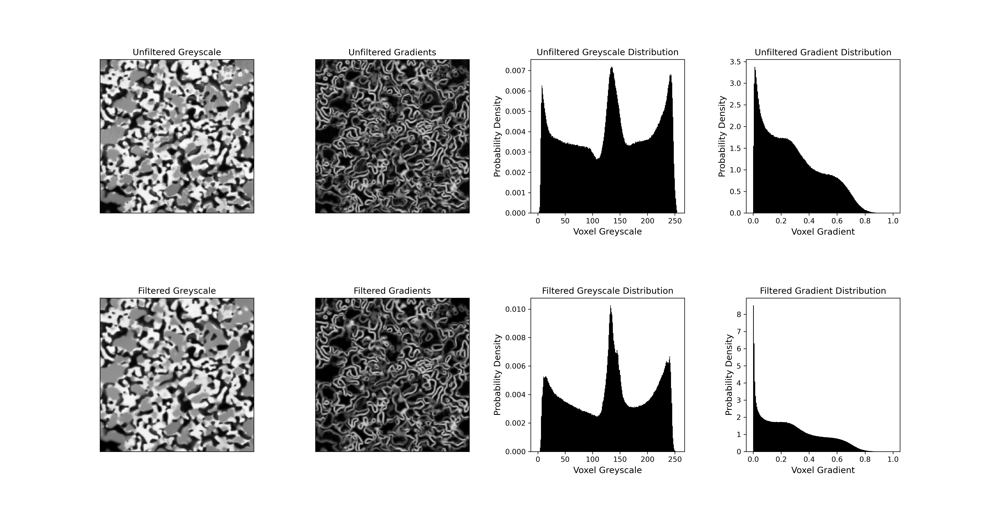

# 📦 Automatic-PWPID

Automatic Post-Watershed Phase-ID Segmentation (PWPID): automatically segments 3D, 3-phase microstructure images using watershed transform. 

---

## 📓 Overview

This project performs 3D segmentation on 3-phase microstructure datasets where phases can be differentiated via their greyscale  values. The code processes 3D microstructure reconstructions and perform phase segmentation, where each voxel is labeled with 1,2, or 3 depending on its phase. It was developed and tested for segmenting 3-phase solid oxide cell (SOC) microstructures. This code requires files in the [.npy](https://numpy.org/doc/stable/reference/generated/numpy.lib.format.html) file format. 

---

## 📁 Repository Structure

Automatic-PWPID/ 

├── main.py # Main segmentation script 

├── segmentation_utils.py # Helper functions 

├── NLM_FILTER.py # Script for running non-local means filtering

├── test_files/ # Example data for testing script 

├── requirements.txt # Dependencies 

└── README.md # Project documentation

---

## 🛠️ Usage

Two main files are used for segmentation: `NLM_FILTER.py` helps prepare data for segmentation and `main.py` performs segmentation.

### Image Pre Processing with `NLM_FILTER.py`

This implementation of watershed segmentation operates on a gradient image computed with the [Sobel filter](https://en.wikipedia.org/wiki/Sobel_operator), which can be sensitive to imaging noise. It is _highly_ recommended that anyone using this segmentation method first filter their data using a non-local means (NLM) filter.  `NLM_FILTER.py` can be used to filter your data and decide the correct filtering parameters.

Here's a simple example:

<pre>python NLM_FILTER.py "./path/to/file.npy" sweep  </pre>

The code above will run a parametric sweep of the filter cutoff (read more about how NLM filtering works [here](https://doi.org/10.1109/CVPR.2005.38)) and plot the resulting gradient distributions and sample gradient image. These results will be saved in `./path/to/file_NLM_SWEEP` or `./path/to/file_NLM_SWEEP_i` if there are preexisting sweep results. Figures will be saved with the resulting gradient distributions and sample gradient images. 

The figure below shows a comparison between the grayscale images, gradient images, greyscale distributions, and gradient distributions before and after NLM filtering. The greyscale image below contains curtaining artifacts and intra-region greyscale variability that show up as grey patches in the gradient image and tall second and third maxima in the gradient distribution. These kinds of artifacts/noise can cause issues during segmentation. When selecting a filter cutoff (h), it is recommended that the value should be selected that yields the _tallest_ first peak in the gradient distribution and the _lowest_ second and third peak. A tall first peak signifies low intra region greyscale variability and low second and third peaks signify sharp inter-phase boundaries, which are ideal for segmentation. If the filtering is _too_  aggressive  (h is too high), the three peaks will begin to merge as boundaries are blurred together. 

  
   
  <em>Comparison of unfiltered and filtered images: greyscale images, gradient images, greyscale distribution, gradient distribution.</em>

