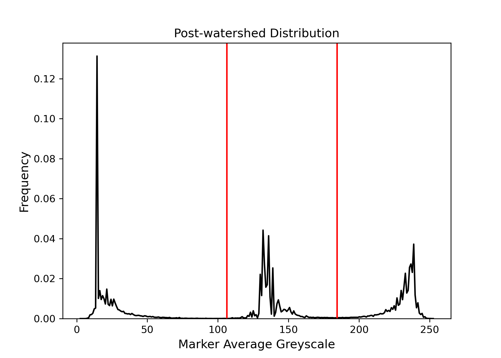

# 📦 Automated-PWPID

Automated Post-Watershed Phase-ID Segmentation (PWPID):  segments 3D, 3-phase microstructure images using watershed transform. 

---

## 📓 Overview

This project performs 3D segmentation on 3-phase microstructure datasets where phases can be differentiated via their greyscale  values. The code processes 3D microstructure reconstructions and perform phase segmentation, where each voxel is labeled with 1,2, or 3 depending on its phase. It was developed and tested for segmenting 3-phase solid oxide cell (SOC) microstructures. This code supports files in the [.npy](https://numpy.org/doc/stable/reference/generated/numpy.lib.format.html) and [.tiff](https://www.adobe.com/creativecloud/file-types/image/raster/tiff-file.html#:~:text=A%20TIFF%2C%20which%20stands%20for,to%20avoid%20lossy%20file%20formats.) file formats. 

If you use code, we ask that you please cite it with 

---

## 📁 Repository Structure

Automated-PWPID/ 

├── `main.py` # Main segmentation script 

├── `segmentation_utils.py` # Helper functions 

├── `NLM_FILTER.py` # Script for running non-local means filtering

├── `CONV_FILE.py` # Script for converting between `.npy`, `.tif`, and `.tiff` files.

├── `test_files/` # Example data for testing script 

├── `requirements.txt` # Dependencies 

└── `README.md` # Project documentation

---

## Installation and Dependencies

All segmentation codes are written in Python, which can be downloaded and installed [here](https://www.python.org/downloads/). Codes have been tested for Python version 3.11.8. 

Dependencies are listed in `requirements.txt`. It is recommended that a package manager like [Anaconda](https://www.anaconda.com/docs/getting-started/miniconda/install#macos-linux-installation) or [pip](https://pypi.org/project/pip/) is used for installing Python libraries. 

To avoid conflicting dependencies, it is best to make a virtual environment with its own python modules. You can create an environment called `segment` and install all of the dependencies with the code below:

<pre>
conda create --name segment python==3.11.8
conda activate segment
pip install -r requirements.txt
</pre>

If the environment does not properly install all of the dependencies in `requirements.txt`, or if you wish to manually install each dependency, you should be able to using the commands below:

<pre>pip install numpy==2.2.4
pip install matplotlib==3.10.1
pip install scipy==1.15.2
pip install scikit-image==0.25.2
pip install opencv-python==4.11.0.86
pip install pandas==2.2.3
pip install tqdm==4.67.1
pip install connected-components-3d==3.23.0
pip install pqdm==0.2.0
pip install PyWavelets==1.8.0
</pre>

---

## 🛠️ Usage

Two main files are used for segmentation: `NLM_FILTER.py` helps prepare data for segmentation and `main.py` performs segmentation.

### Image Pre Processing with `NLM_FILTER.py`

This implementation of watershed segmentation operates on a gradient image computed with the [Sobel filter](https://en.wikipedia.org/wiki/Sobel_operator), which can be sensitive to imaging noise. It is _highly_ recommended that anyone using this segmentation method first filter their data using a non-local means (NLM) filter.  `NLM_FILTER.py` can be used to filter your data and decide the correct filtering parameters.

Here's a simple example:

<pre>python NLM_FILTER.py "./path/to/file.npy" sweep  </pre>

The code above will run a parametric sweep of the filter cutoff `h` (read more about how NLM filtering works [here](https://doi.org/10.1109/CVPR.2005.38)) and plot the resulting gradient distributions and sample gradient images. These results will be saved in `./path/to/file_NLM_SWEEP` or `./path/to/file_NLM_SWEEP_i` if there are preexisting sweep results. Figures will be saved with the resulting gradient distributions and sample gradient images. `NLM_FILTER.py` can take `.npy`, `.tif`, and `.tiff` files as input.  

`NLM_FILTER.py` has options to manually enter sweep parameters. Here's an example:

<pre>python NLM_FILTER.py "./path/to/file.npy" sweep  -b_h 1.0 -t_h 10.0 -nh 50 -comp parallel -save True </pre>

The code snippet above will test 50 equally-spaced values for `h` ranging from `1.0` to `10.0`. `-b_h` and `-t_h` specify the minimum and maximum `h` values to test, respectively. The default values are `0.0` and `5.0`, respectively. `-nh` specifies how many `h` values to test (default is `10`).  `-comp` allows the user to run the sweep either in `serial` or `parallel`. `serial` mode tests one filter at a time while `parallel` uses all available processing cores to test the filters in parallel. The default mode is `serial`. It is recommended to use `parallel` mode unless the size of the 3D image being filtered is a significant portion of your computer's RAM. `-save` specifies whether or not to save the 3D image filtered at each tested `h`. The default `-save` is `False`.

Once a value for `h` has been selected, you can obtain a filtered image like so

<pre>python NLM_FILTER.py "./path/to/file.npy" single 1.0 </pre>

The code above will filter `file.npy` with an `h` of `1.0` and save the filtered image as `./path/to/file_filtered.npy`.

Output files will be saved with the same file format as the input (i.e. `.tif`, `.tiff`, or `.npy`).

#### How to select the proper `h` value?

The figure below shows a comparison between the grayscale images, gradient images, greyscale distributions, and gradient distributions before and after NLM filtering. The greyscale image below contains curtaining artifacts and intra-region greyscale variability that show up as grey patches in the gradient image and tall second and third maxima in the gradient distribution. These kinds of artifacts/noise can cause issues during segmentation. When selecting a filter cutoff `h`, it is recommended that the value should be selected that yields the _tallest_ first peak in the gradient distribution and the _lowest_ second and third peaks. A tall first peak signifies low intra region greyscale variability and low second and third peaks signify sharp inter-phase boundaries, which are ideal for segmentation. If the filtering is _too_  aggressive  (h is too high), the three peaks will begin to merge as boundaries are blurred together. 

  
   
  <em>Comparison of unfiltered and filtered images: greyscale images, gradient images, greyscale distribution, gradient distribution.</em>

Bear this in mind: if your microstructure contains a spatially heterogeneous distribution of boundary gradients (i.e. parts of the image have sharp boundaries and other parts have blurry boundaries), the value for `h` that yields the best _overall_ gradient distribution may cause excessively low-gradient (blurry) boundaries in other parts of the distribution. This can result in significant under-segmentation. You can spot this problem prior to segmentation by inspecting the gradient image at locations with blurry boundaries. If the boundary(ies) of interest are dark in color relative to their sharp neighboring boundaries, use a lower `h` value.

### Segmenting with `main.py`

If you have not read the prior section on image pre-processing, it is highly recommended to do so. 

The codes herein implement manual and automated versions of the segmentation methodology detailed in  _Automated Phase Segmentation with Quantifiable Sensitivities of Three-Phase Microstructures of Solid Oxide Cell Electrodes_ submitted to Materials Characterization (under review).

All functions in `main.py` explained below can segment a _single_ file or _all relevant_ files in a folder. If the path to a _file_ is provided, the code will segment that file. If the path to a _folder_ is provided, the code will segment every relevant file in that folder. It is recommended that you remove any unnecessary files from the folder before running the code so as not to confuse the input-output functions. 

Segmentation can be performed manually or in an automated fashion using `main.py`. 

#### Automated Segmentation

A single 3D image can be segmented using the automated method with the following line

<pre>python main.py "./path/to/file.npy" full </pre>

This line of code will do the following:
1. Compute a gradient image of `file.npy`.
	- Gradient image will be saved at  `./path/to/file_gradients.npy`
2. Perform a paramteric sweep of a threshold applied to the gradient image (the thresholded volume is used as markers). 
3. Plot the results of the gradient threshold sweep and determine which tested gradient threshold yielded the maximum number of markers. 
	-  Tested gradient thresholds and corresponding number of markers are saved in `file_num_marker.csv` 
	-  Gradient threshold sweep results are plotted in  `file_thresh_sweep.png`
4. Watershed `file_gradients.npy` using markers obtained after applying the threshold determined in the previous step. 
	- Watershedded image with watershed regions assigned _unique labels_ is saved at `file_seg_img.npy`.
	- Watershedded image with watershed regions assigned the _average voxel greyscale value of their parent marker_ is saved at `file_avg_img.npy`.
	- The average greyscale of each marker is saved in `file_avg_grey.npy`.
	- The size of each watershed region is saved in `file_size.npy`
	- The size of each marker is saved in `file_marker_size.npy`
5. Analyze the distribution of marker average greyscales and find the two minima between the three greyscale distributions (two thresholds to separate three phases). 
	- Resulting distribution and thresholds are plotted in `file_post-water_dist.png`.
6. Apply the greyscale thresholds to the watershedded image, yielding the final phase segmented image. 
	- The segmented 3D images will be saved at `./path/to/file_final_seg.npy`
	- A preview slice of the segmented image will be saved at `./path/to/file_final_slice_0.png`
	- Final segmentation parameters will be saved in `./path/to/file_seg_params.txt`
	
Some example outputs from segmenting `test_files/test_volume.npy` (a Xe Plasma FIB-SEM reconstruction of an SOFC cathode) are shown below 

  
   
  <em>Results of gradient threshold sweep: Number of Markers. Vs Gradient Threshold</em>

  
   
  <em>Post watershed distribution (black) and greyscale thresholds (red) at 106 and 184. </em>

  
   
  <em>Comparison of greyscale and segmented dataset.</em>

The automated code assumes that `0.0` and `0.3` is a reasonable range for  running the gradient threshold sweep. If the gradient threshold does not yield a clear minimum, or if more thresholds should be tested, you can run the code as follows:

<pre>python main.py "./path/to/file.npy" full -b_thresh 0.0 -t_thresh 0.5 -nthresh 100 -comp parallel </pre>

The code above will run the threshold sweep with `100` values ranging from `0.0` to `0.5`. `-comp parallel` will have the code use all available processing cores to run the sweep in parallel. 

The automated implementation of segmentation can take `.tif` and 	`.tiff` image stacks as input in addition to `.npy` files. The final segmented image will be saved to `./path/to/file_final_seg.tiff` if the input file is `.tiff` or `.tif`. All other files generated from the segmentation will be saved as `.npy` files.

If you wish to segment all files in a folder:

<pre>python main.py "./path/to/folder" full -b_thresh 0.0 -t_thresh 0.5 -nthresh 100 -comp parallel </pre>

The code above will segment all files with recognized file extensions (`.npy`, `.tif`, `.tiff`). If the folder contains files with `.npy` _AND_ `.tif` or `.tiff`, the code will raise an error and cease execution. All files produced from each segmentation will be save in `./path/to/folder`.

#### Manual Segmentation

Three segmentation steps can be run manually if desired. 

If only running the gradient threshold sweep is desired:

<pre>python main.py "./path/to/file.npy" thresh -b_thresh 0.0 -t_thresh 0.5 -nthresh 100 -mode parallel </pre>

The code snippet above will compute the gradient image of `file.npy` and run the gradient threshold sweep from `0.0` to `0.5` with `100` values. Results will be saved in `num_markers.csv`. The gradient threshold sweep can take `.tif` and `.tiff` files as input. All outputs will be saved as `.npy` files.

If wanting to watershed an image at a specific gradient threshold:

<pre>python main.py "./path/to/file.npy" watershed 0.15 </pre>

The code snippet above will compute the gradient image of `file.npy` and perform the watershed transform with the gradient threshold `0.15`. Output files from step 4 above will be saved. The watershed function can take `.tif` and `.tiff` files as input. All outputs will be saved as `.npy` files.

If you want to phase-ID a watershedded image:

<pre>python main.py "./path/to/file_avg_img.npy" phase_id 100 180 </pre>

The code snippet above will phase-ID the input post-watershed image with regions assigned the marker average greyscale according to black-grey threshold `100` and grey-white threshold `180`. The phase-id function _cannot_ take `.tif` and `.tiff` files as input, only `.npy` files. This function should only be used on the `file_avg_img.npy` output from the watershed function. All outputs will be saved as `.npy` files.

Similar to the full automated segmentation, each of the individual steps described above can be run on a folder of files. 

### Converting between 3D `.npy` and 2D `.tiff` stacks with `CONV_FILE.py`

It is common for 3D microstructure reconstructions to be saved as a stack of 2D images in a single `.tif` or `.tiff` file. `CONV_FILE.py` contains functions that allow users to convert between `.npy` files and `.tif` and `.tiff` files. 

To convert a `.tif` file to a `.npy` file:

<pre>python CONV_FILE.py "./path/to/file.tif" </pre>

The code above will save the `.npy` file at `./path/to/file.npy`.

To convert a `.npy` file to a `.tiff` file:

<pre>python CONV_FILE.py "./path/to/file.npy" </pre>

The code above will save the `.tiff` file at `./path/to/file.tiff`.

To convert a `.npy` file to a `.tif` file:

<pre>python CONV_FILE.py "./path/to/file.npy" -format .tif</pre>

The code above will save the `.npy` file at `./path/to/file.tif`. When using the `-format` flag with `.tif` or `.tiff`, the code assumes that the input file has the `.npy` format.

