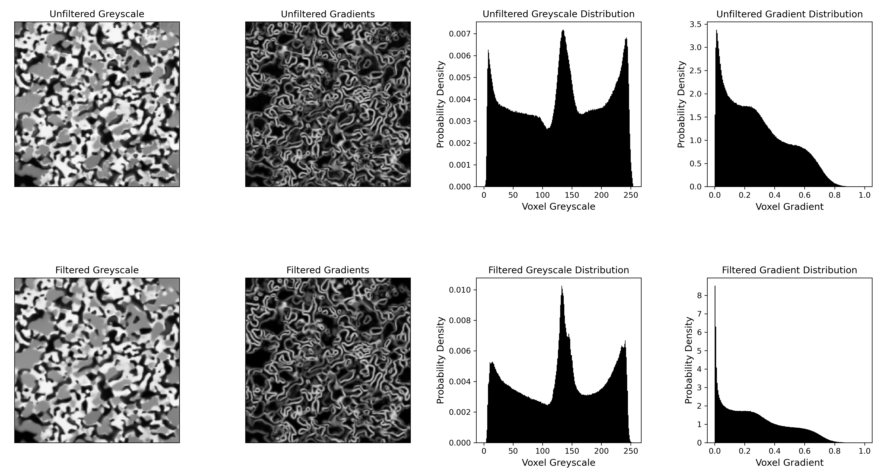

# 📦 Automatic-PWPID

Automatic Post-Watershed Phase-ID Segmentation (PWPID): automatically segments 3D, 3-phase microstructure images using watershed transform. 

---

## 📓 Overview

This project performs 3D segmentation on 3-phase microstructure datasets where phases can be differentiated via their greyscale  values. The code processes 3D microstructure reconstructions and perform phase segmentation, where each voxel is labeled with 1,2, or 3 depending on its phase. It was developed and tested for segmenting 3-phase solid oxide cell (SOC) microstructures. This code requires files in the [.npy](https://numpy.org/doc/stable/reference/generated/numpy.lib.format.html) file format. 

---

## 📁 Repository Structure

Automatic-PWPID/ 

├── main.py # Main segmentation script 

├── segmentation_utils.py # Helper functions 

├── NLM_FILTER.py # Script for running non-local means filtering

├── test_files/ # Example data for testing script 

├── requirements.txt # Dependencies 

└── README.md # Project documentation

---

## 🛠️ Usage

Two main files are used for segmentation: `NLM_FILTER.py` helps prepare data for segmentation and `main.py` performs segmentation.

### Image Pre Processing with `NLM_FILTER.py`

This implementation of watershed segmentation operates on a gradient image computed with the [Sobel filter](https://en.wikipedia.org/wiki/Sobel_operator), which can be sensitive to imaging noise. It is _highly_ recommended that anyone using this segmentation method first filter their data using a non-local means (NLM) filter.  `NLM_FILTER.py` can be used to filter your data and decide the correct filtering parameters.

Here's a simple example:

<pre>python NLM_FILTER.py "./path/to/file.npy" sweep  </pre>

The code above will run a parametric sweep of the filter cutoff `h` (read more about how NLM filtering works [here](https://doi.org/10.1109/CVPR.2005.38)) and plot the resulting gradient distributions and sample gradient image. These results will be saved in `./path/to/file_NLM_SWEEP` or `./path/to/file_NLM_SWEEP_i` if there are preexisting sweep results. Figures will be saved with the resulting gradient distributions and sample gradient images. 

`NLM_FILTER.py` has options to manually enter sweep parameters. Here's an example:

<pre>python NLM_FILTER.py "./path/to/file.npy" sweep  -b_h 1.0 -t_h 10.0 -nh 50 -comp parallel -save True </pre>

The code snippet above will test 50 equally-spaced values for `h` ranging from `1.0` to `10.0`. `-b_h` and `-t_h` specify the minimum and maximum `h` values to test, respectively. The default values are `0.0` and `5.0`, respectively. `-nh` specifies how many `h` values to test (default is `10`).  `-comp` allows the user to run the sweep either in `serial` or `parallel`. `serial` mode tests one filter at a time while `parallel` uses all available processing cores to test the filters in parallel. The default mode is `serial`. It is recommended to use `parallel` mode unless the size of the 3D image being filtered is a significant portion of your computer's RAM. `-save` specifies whether or not to save the 3D image filtered at each tested `h`. The default `-save` is `False`.

Once a value for `h` has been selected, you can obtain a filtered image like so

<pre>python NLM_FILTER.py "./path/to/file.npy" single 1.0 </pre>

The code above will filter `file.npy` with an `h` of `1.0` and save the filtered image as `./path/to/file_filtered.npy`.

#### How to select the proper `h` value?

The figure below shows a comparison between the grayscale images, gradient images, greyscale distributions, and gradient distributions before and after NLM filtering. The greyscale image below contains curtaining artifacts and intra-region greyscale variability that show up as grey patches in the gradient image and tall second and third maxima in the gradient distribution. These kinds of artifacts/noise can cause issues during segmentation. When selecting a filter cutoff `h`, it is recommended that the value should be selected that yields the _tallest_ first peak in the gradient distribution and the _lowest_ second and third peaks. A tall first peak signifies low intra region greyscale variability and low second and third peaks signify sharp inter-phase boundaries, which are ideal for segmentation. If the filtering is _too_  aggressive  (h is too high), the three peaks will begin to merge as boundaries are blurred together. 

  
   
  <em>Comparison of unfiltered and filtered images: greyscale images, gradient images, greyscale distribution, gradient distribution.</em>

Bear this in mind: if your microstructure contains a spatially heterogeneous distribution of boundary gradients (i.e. parts of the image have sharp boundaries and other parts have blurry boundaries), the value for `h` that yields the best _overall_ gradient distribution may cause excessively low-gradient (blurry) boundaries in other parts of the distribution. This can result in significant under-segmentation. You can spot this problem prior to segmentation by inspecting the gradient image at locations with blurry boundaries. If the boundary(ies) of interest are dark in color relative to their sharp neighboring boundaries, use a lower `h` value.

### Segmenting with `main.py`

If you have not read the prior section on image pre-processing, it is highly recommended to do so. 

Segmentation can be performed manually or automatically using `main.py`. A 3D image can be segmented automatically with the following line

<pre>python main.py "./path/to/file.npy" full </pre>

This line of code will do the following:
1. Compute a gradient image of `file.npy`.
	- Gradient image will be saved at  `./path/to/file_gradients.npy`
2. Perform a paramteric sweep of a threshold applied to the gradient image (the thresholded volume is used as markers). 
3. Plot the results of the gradient threshold sweep and determine which tested gradient threshold yielded the maximum number of markers. 
	-  Tested gradient thresholds and corresponding number of markers are saved in `num_marker.csv` 
	-  Gradient threshold sweep results are plotted in  `file_thresh_sweep.png`
4. Watershed `file_gradients.npy` using markers obtained using the threshold determined in the previous step. 
	- Watershedded image with watershed regions assigned _unique labels_ is saved at `file_seg_img.npy`.
	- Watershedded image with watershed regions assigned the _average voxel greyscale value of their parent marker_ is saved at `file_avg_img.npy`.
	- The average greyscale of each marker is saved in `file_avg_grey.npy`.
	- The size of each watershed region is saved in `file_size.npy'
	- The size of each marker is saved in `file_marker_size.npy'
5. Analyze the distribution of marker average greyscales and find the two minima between the three greyscale distributions (two thresholds to separate three phases). 
	- Resulting distribution and thresholds are plotted in `file_post-water_dist.png`.
6. Apply the greyscale thresholds to the watershedded image, yielding the final phase segmented image. 
	- This will be saved at `./path/to/file_final_seg.npy`

